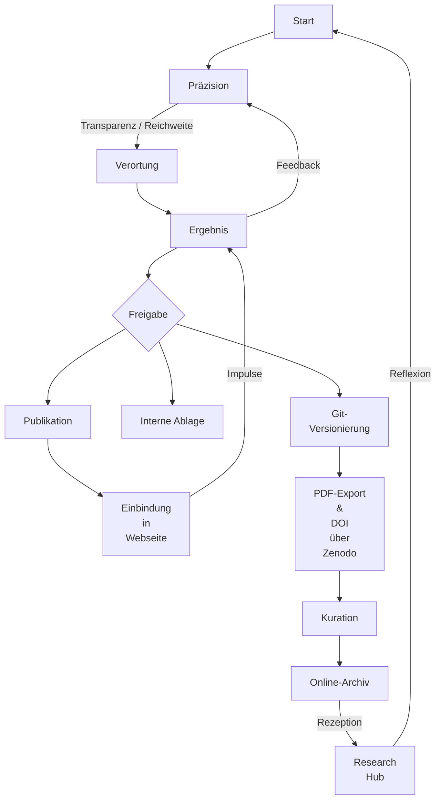

# Methodik und Veröffentlichungspraxis

**A**lle auf dieser Webseite veröffentlichten Inhalte basieren auf einem unabhängigen, theoretischen Forschungsansatz und repräsentieren Grundlagenforschung. Die Arbeiten folgen den Prinzipien wissenschaftlicher Redlichkeit, wurden jedoch bewusst keinem Peer-Review-Verfahren unterzogen. Ziel ist es, neue interdisziplinäre Perspektiven frei von traditionellen Publikationsrestriktionen zugänglich zu machen und zur Diskussion zu stellen.

**D**ie Webseite dient nicht nur der wissenschaftlichen Community, sondern auch der breiteren Öffentlichkeit als Plattform für Erkenntnisgewinn und Reflexion. Die Möglichkeit, Wissen dynamisch zu erweitern und kontinuierlich weiterzuentwickeln, steht im Mittelpunkt dieses Ansatzes.

**J**ede veröffentlichte Notiz wird durch ein begleitendes Entwicklungsprotokoll ergänzt, das die Entstehungslogik, Wendepunkte, Irrtümer und systemischen Beiträge dokumentiert. Dieses Protokoll wird als _empty commit_ in die Git-Historie eingebunden und reflektiert die Entstehung als erkenntnistheoretischen Prozess.
## Gütekriterien und Archivierung

**J**ede Veröffentlichung beginnt mit einem Erkenntnisinteresse, das sich in der Präzisierung und Herleitung von Begriffen und Konzepten manifestiert. Diese werden in systemischen oder bildungswissenschaftlichen Kontexten verortet und iterativ weiterentwickelt. Dieser Ansatz folgt der Empfehlung von Döring (2023b), bereits in frühen Phasen qualitativer Forschung bewusst auf Zielsetzung und Aussagekraft zu achten. Qualität wird dabei nicht nur am Ergebnis gemessen, sondern am gesamten Prozess.

**D**ie Entscheidung, ob ein Beitrag veröffentlicht oder als interne Arbeitshilfe archiviert wird, basiert auf einer kritischen Reflexion der Relevanz für Systemtheorie, Rettungsdienst oder Bildungswissenschaft. Veröffentlichungswürdig sind Beiträge, die neue Perspektiven eröffnen oder Lücken in der Fachliteratur schließen. Dies folgt der Forderung, Gütekriterien explizit zu begründen und nachvollziehbar anzuwenden (Döring, 2023b).

**A**uch im Sinne eines konstruktivistischen Wissenschaftsverständnisses wird die Auswahl und Anwendung der Kriterien transparent reflektiert:

- **Wer favorisiert welche Kriterien – und weshalb?**
- **Welche Vor- oder Nachteile ergeben sich daraus für bestimmte Forschungsansätze?**

**E**in Verzicht auf diese Reflexion würde, wie Döring betont, zu Beliebigkeit führen und Kritik erschweren.

**Z**ur Sicherung der Originalfassung wird jede veröffentlichte Notiz als statisches PDF archiviert und mit DOI auf [Zenodo](https://zenodo.org) hinterlegt. Dies konserviert den Stand zum Veröffentlichungszeitpunkt. Die DOI wird in der Notiz referenziert. Die dynamische Entwicklung der Webseite bleibt davon unberührt – sie wird dokumentiert über [git.jochen-hanisch.de](https://git.jochen-hanisch.de).

_Abbildung 1: Ablauf der Veröffentlichung (eig. Darstellung)_

**D**ie Git-Historie dient nicht nur der technischen Versionierung, sondern dokumentiert bewusst erkenntnistheoretisch relevante Entwicklungsschritte. Sie wird als eigenständiges Artefakt epistemischer Praxis betrachtet.

**D**ie iterative Weiterentwicklung durch Feedback und Rückmeldung entspricht dem Ideal qualitativer Forschung: Erkenntnis entsteht im Dialog. Diese Praxis ist nicht nur Ausdruck methodischer Offenheit, sondern auch wissenschaftlicher Verantwortung (Döring, 2023b).
### Vier Prinzipien leiten die Veröffentlichungspraxis:

1. **Zielgerichtete Qualitätssicherung** – Klare Zieldefinition ab Beginn.
2. **Explizite Kriterienwahl** – Bewusste Auswahl und Begründung der Maßstäbe.
3. **Vermeidung von Beliebigkeit** – Transparente Struktur statt Beliebigkeit.
4. **Reflexion der Konstruiertheit** – Selbstkritischer Umgang mit erkenntnistheoretischen Prämissen.

**D**iese Praxis reflektiert die Überzeugung, dass Wissenschaft offen, nachvollziehbar und dialogisch sein muss – um Innovation und neue Denkansätze zu ermöglichen.

## Wissenschaftskommunikation und Öffentlichkeitsarbeit

**D**iese Webseite versteht sich als Instrument systemisch reflexiver Wissenschaftskommunikation. Forschungsergebnisse sollen nicht nur innerhalb von Fachkreisen, sondern auch im öffentlichen Raum Wirkung entfalten.

**I**n einer zunehmend vernetzten Wissenschaftslandschaft ersetzen dynamische, kuratierte Webformate zunehmend klassische Monografien. Plattformen wie ResearchGate oder Zenodo dienen der Archivierung, Git der Versionierung.

**F**achkolleg:innen und Interessierte sind eingeladen, Rückmeldungen zu geben – etwa über [b-Quadrat – Der Educast](https://git.jochen-hanisch.de/bzpg). Kritik und Anregung sind Teil des wissenschaftlichen Prozesses.

## Notizstatus-Kennzeichnung

**U**m den Entwicklungsstand einzelner Texte transparent zu halten, wird eine Statuskennzeichnung verwendet:

1. **Draft** – Entwürfe, die sich noch in Bearbeitung befinden.
2. **Pre-Publish** – Nahezu fertiggestellt, noch in der finalen Prüfung.
3. **Review** – Veröffentlicht, aber im Modus regelmäßiger Reflexion.
4. **Published** – Final veröffentlichte Version mit DOI.

**D**raft- und Pre-Publish-Notizen erscheinen in der Regel nicht auf der Webseite.

## Zitierhinweise der Beiträge

**D**ie Veröffentlichungen stehen unter der **Creative Commons Lizenz (CC BY-NC 4.0)**. Sie dürfen unter Angabe der Quelle für nicht-kommerzielle Zwecke genutzt, geteilt und angepasst werden. ([Details zur Lizenz](https://creativecommons.org/licenses/by-nc/4.0/))

**A**lle Inhalte dieser Webseite können entsprechend wissenschaftlicher Standards zitiert werden. Nutzer:innen werden gebeten, die Zitationsrichtlinien ihres jeweiligen Fachbereichs zu beachten.

**N**eben den finalen PDF-Fassungen mit DOI wird auch auf relevante Git-Commits verwiesen, sofern diese erkenntnisrelevante Protokolle oder Umstrukturierungen enthalten.

## Epistemische Protokollpraxis

**A**ls Bestandteil einer erkenntnistheoretisch verantworteten Forschungspraxis werden zentrale Entwicklungsschritte durch schriftlich fixierte Protokolle sichtbar gemacht. Diese dokumentieren (https://git.jochen-hanisch.de/explore/repos):

- Erkenntnisanlässe, Wendepunkte, Fehlannahmen
- Rollenverteilungen zwischen Forscher und System
- Transformationen der theoretischen Perspektive

**D**ie Protokolle werden in die Git-Versionsgeschichte eingebunden, wodurch der Prozesscharakter von Wissenschaft explizit nachvollziehbar wird. Sie machen sichtbar, dass Irrtum, Revision und Emergenz keine Schwächen sind – sondern genuiner Bestandteil wissenschaftlicher Erkenntnis.

## Hinweis zur Nutzung von OpenAI

**B**ei der Erstellung meiner Beiträge nutze ich gezielt das aktuellste OpenAI-Modell, um komplexe Themen systematisch zu strukturieren und methodisch nachvollziehbar darzustellen – insbesondere in der Integration theoretischer und technischer Inhalte.

**D**ie Nutzung generativer KI erfolgt im Rahmen eines reflektierten wissenschaftlichen Prozesses. OpenAI dient dabei als Werkzeug zur Textkonstruktion, nicht als inhaltlich autoritative Quelle. Die finale Validierung liegt vollständig bei mir.

**D**ieser Ansatz entspricht der Position von Kerres et al. (2024), KI als unterstützendes, jedoch kritisch zu reflektierendes Werkzeug zu nutzen – mit dem Ziel, wissenschaftliche Denkansätze zu erweitern und Innovation zu fördern.

# Quelle(n)

- Döring, N. (2023a). Ergebnispräsentation. In N. Döring, _Forschungsmethoden und Evaluation in den Sozial- und Humanwissenschaften_ (S. 767–786). Springer. https://doi.org/10.1007/978-3-662-64762-2_13
- Döring, N. (2023b). Qualitätskriterien. In N. Döring, _Forschungsmethoden und Evaluation in den Sozial- und Humanwissenschaften_ (S. 79–118). Springer. https://doi.org/10.1007/978-3-662-64762-2_3
- Kerres, M., Klar, M., & Mulders, M. (2024). Informationskompetenz neu denken. _Erwachsenenbildung_, 2, 52–57.

---

[[Impressum]] | [[Datenschutz]] | [[Disclaimer]] | [[Allgemeine Geschäftsbedingungen]] | [[Kontakt]]
