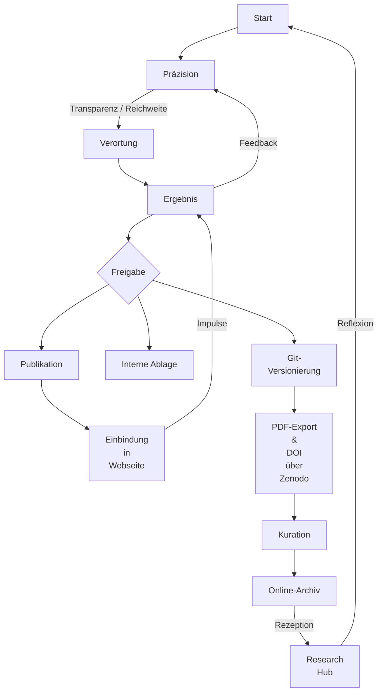

## Arbeits- und Forschungspraxis

**A**lle auf dieser Webseite veröffentlichten Inhalte basieren auf einem unabhängigen, theoretischen Forschungsansatz und repräsentieren Grundlagenforschung. Die Arbeiten folgen den Prinzipien wissenschaftlicher Redlichkeit, wurden jedoch bewusst keinem Peer-Review-Verfahren unterzogen. Ziel ist es, neue interdisziplinäre Perspektiven frei von traditionellen Publikationsrestriktionen zugänglich zu machen und zur Diskussion zu stellen.

**D**ie Webseite dient sowohl der wissenschaftlichen Community als auch der breiteren Öffentlichkeit als Plattform für Erkenntnisgewinn und Reflexion. Wissen darf sich dynamisch erweitern und kontinuierlich weiterentwickeln – Transparenz und Anschlussfähigkeit stehen vor Abschluss.

**J**ede veröffentlichte Notiz erhält ein begleitendes Entwicklungsprotokoll. Es dokumentiert Entstehungslogik, Wendepunkte, Irrtümer und systemische Beiträge und wird als empty commit in die Git-Historie integriert. Damit wird der Erkenntnisprozess selbst zum zitierbaren Artefakt.

## Versionierung als epistemische Operation

Versionierung fungiert nicht als Archivierung, sondern als Denkakt. „Veröffentlichen“ und „Versionieren“ markieren unterschiedliche Operationen innerhalb eines offenen, epistemisch transparenten Forschungsprozesses.

### Versionierungslogik

| Ebene | Operation | Bedeutung |
| --- | --- | --- |
| Nicht versioniert | Arbeiten im inneren Raum: denken, entwerfen, verknüpfen, verlaufen | -> präreflexive Notiz |
| Versioniert (`git add` + `git commit`) | Öffnen eines Gedankenganges gegenüber der Öffentlichkeit – nachvollziehbar, aber noch nicht formal abgeschlossen | -> transparente Denkspur |
| Veröffentlicht (z. B. Zenodo, DOI) | Setzen einer formalen Markierung im wissenschaftlichen Kommunikationssystem | -> veröffentlichte Erkenntnis |

Ab dem Moment, in dem `git add` ausgeführt wird, beginnt der öffentliche Erkenntnisprozess. Entscheidend ist nicht der fertige Gedanke, sondern seine nachvollziehbare Entstehung – Git wird zum epistemologischen Protokollsystem.

### Git als epistemisches Protokoll

| Systemoperation | Epistemosphaerische Bedeutung |
| --- | --- |
| `git add` | Inversion – Übergang von innerer Reflexion zu beobachtbarer Form |
| `git commit` | Stabilisierung des Gedankens (Reflexion) |
| `git push` | Reentry – der Gedanke tritt in die Öffentlichkeit |
| DOI / Zenodo | Veröffentlichung – kommunikative Fixierung im wissenschaftlichen System |

### Praktische Umsetzung

1. Frei in Obsidian arbeiten.
2. Sobald ein Gedanke sichtbar werden darf (beobachtbar, aber nicht abgeschlossen):

   ```bash
   git add Research/Bildungswissenschaft/Epistemosphaere.md
   git commit -m "Beginn der öffentlichen Versionierung: Epistemosphäre"
   git push
   ```

3. Ab dann bleibt jede Änderung über GitHub öffentlich nachvollziehbar.

Konsequenzen:

- Ein öffentliches Repository (`research`) reicht vollständig aus.
- `git add` entscheidet granular, welcher Gedanke in die Welt tritt.
- Dateien ohne `git add` bleiben unsichtbar, solange es nötig ist.
- Commits lassen sich semantisch markieren, z. B. `git commit -m "[Reflexion] Neue Perspektive auf epistemische Selbstreferenz"` oder `git commit -m "[Reentry] Veröffentlichung der visualisierten Schleife"`.

### Kurz gesagt

- Versioniert heißt: sichtbar, aber nicht fertig.
- Veröffentlicht heißt: abgeschlossen, formalisiert, mit DOI.
- Nicht versioniert heißt: privat, fluide, vorläufig.

Der Übergang wird nicht über Repositories, sondern über die bewusste Geste des `git add` gesteuert.

## Veröffentlichungsworkflow und Archivierung

Jeder Text beginnt mit einem Erkenntnisinteresse, das über Präzisierung und Herleitung von Begriffen und Konzepten in systemischen oder bildungswissenschaftlichen Kontexten verortet wird. Die dynamische Entwicklung bleibt auf der Webseite sichtbar, während die jeweilige Originalfassung konserviert wird.



_Abbildung 1: Ablauf der Veröffentlichung (eig. Darstellung)_

- Veröffentlichungswürdige Beiträge eröffnen neue Perspektiven oder schließen Lücken in der Fachliteratur – dies wird vor jeder Freigabe kritisch reflektiert.
- Zur Sicherung der Originalfassung wird jede veröffentlichte Notiz als statisches PDF exportiert und mit DOI auf [Zenodo](https://zenodo.org) hinterlegt, die DOI erscheint in der Notiz.
- Die dynamische Weiterentwicklung dokumentiert [git.jochen-hanisch.de](https://git.jochen-hanisch.de); empty commits markieren erkenntnistheoretisch relevante Wendepunkte.
- Erkenntnis entsteht im Dialog: Feedback fließt iterativ in die Texte zurück.

## Gütekriterien und Reflexion

Der gesamte Prozess folgt den Empfehlungen von Döring (2023b): Qualität wird nicht nur am Ergebnis, sondern am Weg dorthin gemessen. Die Auswahl und Anwendung von Gütekriterien erfolgt transparent und konstruktivistisch reflektiert.

Leitfragen:

- Wer favorisiert welche Kriterien – und weshalb?
- Welche Vor- oder Nachteile ergeben sich daraus für bestimmte Forschungsansätze?

### Vier Prinzipien der Veröffentlichungspraxis

1. **Zielgerichtete Qualitätssicherung** – Klare Zieldefinition ab dem Beginn des Projekts.
2. **Explizite Kriterienwahl** – Bewusste Auswahl und Begründung aller Maßstäbe.
3. **Vermeidung von Beliebigkeit** – Strukturierte Entscheidungen statt opportunistischer Veröffentlichungen.
4. **Reflexion der Konstruiertheit** – Selbstkritischer Umgang mit erkenntnistheoretischen Prämissen.

## Wissenschaftskommunikation und Öffentlichkeitsarbeit

Die Webseite versteht sich als Instrument systemisch reflexiver Wissenschaftskommunikation. Forschungsergebnisse sollen nicht nur innerhalb von Fachkreisen, sondern auch im öffentlichen Raum Wirkung entfalten. In einer vernetzten Wissenschaftslandschaft ersetzen dynamische, kuratierte Webformate zunehmend klassische Monografien. Plattformen wie ResearchGate oder Zenodo dienen der Archivierung, Git der Versionierung.

Fachkolleg:innen und interessierte Personen sind ausdrücklich eingeladen, Rückmeldungen über die Kommentar- und Issue-Funktionen im Repository zu geben. Kritik und Anregung sind elementarer Bestandteil des wissenschaftlichen Prozesses.

## Zitierhinweise und Lizenz

Alle Texte und Veröffentlichungen stehen unter der **GNU Affero General Public License, Version 3 (GNU AGPL v3)**. Die Lizenz gewährt umfassende Nutzungs-, Änderungs- und Weitergaberechte, solange die Lizenzbedingungen eingehalten werden. Der vollständige Lizenztext ist verfügbar unter <https://www.gnu.org/licenses/agpl-3.0.html>.

Alle Inhalte dieser Webseite können gemäß den Zitationsrichtlinien des jeweiligen Fachbereichs zitiert werden. Neben den finalen PDF-Fassungen mit DOI werden relevante Git-Commits referenziert, sofern sie erkenntnisrelevante Protokolle oder Umstrukturierungen enthalten.

## Epistemische Protokollpraxis

Zentrale Entwicklungsschritte werden schriftlich fixiert und über die Git-Historie sichtbar gemacht:

- Erkenntnisanlässe, Wendepunkte, Fehlannahmen
- Rollenverteilungen zwischen Forschenden und System
- Transformationen der theoretischen Perspektive

Diese Protokolle zeigen, dass Irrtum, Revision und Emergenz keine Schwächen sind, sondern genuiner Bestandteil wissenschaftlicher Erkenntnis.

## Einsatz von KI-gestützten Werkzeugen

Die Integration von KI-Tools in den Forschungsprozess erfolgt bewusst reflektiert. KI-gestützte Werkzeuge erweitern Denk- und Darstellungsmöglichkeiten, ersetzen jedoch keine fachliche Urteilskraft.

Leitlinien für den Einsatz:

1. **Transparenz** – Offenlegung des KI-Einsatzes in Veröffentlichungen und Protokollen.
2. **Validierung** – Kritische Überprüfung der KI-Ergebnisse durch Expert:innen.
3. **Datenschutz** – Einhaltung geltender Datenschutzbestimmungen bei der Nutzung von KI-Diensten.
4. **Reflexion** – Kontinuierliche Evaluation der Auswirkungen von KI auf Forschungsprozesse und Ergebnisse.

Ich nutze gezielt das jeweils aktuelle OpenAI-Modell, um komplexe Themen zu strukturieren und theoretisch wie technisch miteinander zu verweben. OpenAI dient als Werkzeug zur Textkonstruktion, nicht als inhaltlich autoritative Quelle; die finale Validierung verbleibt vollständig bei mir. Dieser Ansatz folgt Kerres et al. (2024): KI wird als unterstützendes, kritisch zu reflektierendes Instrument eingesetzt, um wissenschaftliche Denkansätze zu erweitern und Innovation zu fördern.

Die Kombination von menschlicher Urteilskraft und KI-Technologie kann Forschung bereichern – vorausgesetzt, ihre Grenzen, Potenziale und epistemischen Implikationen werden offen kommuniziert.

## Quelle(n)

- Döring, N. (2023a). Ergebnispräsentation. In N. Döring, _Forschungsmethoden und Evaluation in den Sozial- und Humanwissenschaften_ (S. 767–786). Springer. https://doi.org/10.1007/978-3-662-64762-2_13
- Döring, N. (2023b). Qualitätskriterien. In N. Döring, _Forschungsmethoden und Evaluation in den Sozial- und Humanwissenschaften_ (S. 79–118). Springer. https://doi.org/10.1007/978-3-662-64762-2_3
- Kerres, M., Klar, M., & Mulders, M. (2024). Informationskompetenz neu denken. _Erwachsenenbildung_, 2, 52–57.

---

[[Impressum]] | [[Datenschutz]] | [[Disclaimer]] | [[Allgemeine Geschäftsbedingungen]] | [[Kontakt]]
